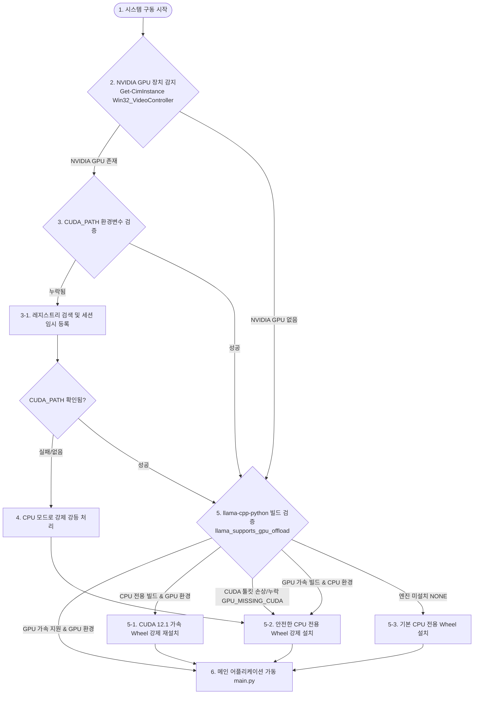

# AMEVA Agent Orchestra - 하드웨어 진단 및 GPU Fallback 알고리즘 가이드

본 문서는 AMEVA Agent Orchestra가 실행 시 사용자 시스템의 **CPU 및 GPU 자원을 감지(Profiling)하고, 최적의 추론 엔진 및 모델 사양을 매핑하며, 저사양 GPU(예: GTX 1070 Ti) 또는 CUDA 미설치 환경에 대응하는 Fallback 알고리즘**을 상세히 분석하여 정리한 기술 가이드라인입니다.

---

## 1. 전체 실행 흐름도 (Architecture Workflow)

시스템 시작 스크립트(`run.ps1` 및 `launch.ps1`) 실행 시 진행되는 진단 및 보정 알고리즘의 전체 흐름은 다음과 같습니다.



---

## 2. 세부 탐지 및 자율 보정 알고리즘 (Detection & Self-Healing)

### 2.1 하드웨어 자원 프로파일링 (Hardware Profiling)
스크립트 가동 단계에서 WMI(Windows Management Instrumentation) 인터페이스를 조회하여 그래픽 카드의 제조사 정보를 수집합니다.
*   **PowerShell 검증 로직:**
    ```powershell
    $videoControllers = Get-CimInstance Win32_VideoController
    $hasNvidia = $false
    foreach ($vc in $videoControllers) {
        if ($vc.Name -match "NVIDIA") { $hasNvidia = $true }
    }
    ```
*   **CUDA Toolkit 환경 변수 보정:**
    NVIDIA GPU가 감지되면 시스템 환경 변수 `CUDA_PATH`를 추적합니다. 만약 환경 변수가 전역 세션에 등록되어 있지 않다면, 윈도우 레지스트리(`Machine` 레벨)에서 직접 조회하여 현재 PowerShell 세션에 실시간 주입함으로써, 재부팅 없이 CUDA 환경을 바인딩합니다.
    ```powershell
    $machineCuda = [Environment]::GetEnvironmentVariable('CUDA_PATH', 'Machine')
    if ($machineCuda) {
        [Environment]::SetEnvironmentVariable('CUDA_PATH', $machineCuda, 'Process')
        $env:PATH += ";$machineCuda\bin"
    }
    ```

### 2.2 LLM 엔진 적합성 실시간 검증 (Engine Integrity Verification)
물리적인 하드웨어 장치(NVIDIA GPU 유무)와 가상환경(`python.exe`) 내부의 `llama-cpp-python` 라이브러리 빌드 정합성을 파이썬 코드로 검증합니다.
*   **자가 진단 코드 (`run.ps1` 내 내부 수행):**
    ```python
    try:
        from llama_cpp import llama_supports_gpu_offload
        print('GPU' if llama_supports_gpu_offload() else 'CPU')
    except Exception as e:
        if 'llama.dll' in str(e) or 'cudart' in str(e).lower(): 
            print('GPU_MISSING_CUDA')
        else: 
            print('NONE')
    ```
*   **불일치 상황 시 대응 시나리오 (Self-Healing Rule):**
    1.  **NVIDIA GPU가 존재하지만 설치된 엔진이 CPU 전용일 때 (`GPU` -> `CPU` 불일치):**
        *   자동으로 CUDA 12.1 가속 지원 바이너리 휠을 다운로드하여 재설치합니다.
        ```powershell
        pip install llama-cpp-python --extra-index-url https://abetlen.github.io/llama-cpp-python/whl/cu121 --force-reinstall --no-cache-dir --only-binary=llama-cpp-python
        ```
    2.  **GPU가 감지되었으나 CUDA 라이브러리 누락으로 `GPU_MISSING_CUDA` 에러가 감지될 때:**
        *   실행 시 발생하는 프로세스 크래시를 원천 차단하기 위해, 자동으로 CPU 전용 안정화 빌드로 다운그레이드(Fallback)하여 재설치합니다.
        ```powershell
        pip install llama-cpp-python --extra-index-url https://abetlen.github.io/llama-cpp-python/whl/cpu --force-reinstall --no-cache-dir --only-binary=llama-cpp-python
        ```
    3.  **NVIDIA GPU가 없는데 GPU 가속 엔진이 빌드되어 있을 때 (`CPU` -> `GPU` 불일치):**
        *   호환성 에러 방지를 위해 CPU 전용 휠로 원복 조치합니다.

---

## 3. GPU 사양에 따른 추론 레이어 제어 (Layer Offloading Strategy)

추론 코어(`core/llm_engine.py`)가 로컬 GGUF 모델을 로드할 때 GPU 지원 여부에 따라 `n_gpu_layers` 매개변수를 제어합니다.

```python
gpu_layers = 0
try:
    gpus = GPUtil.getGPUs()
    if gpus:
        gpu_layers = -1  # 모든 레이어를 GPU에 오프로드
        logger.info(f"CORE: GPU 가속 활성화 -> {gpus[0].name}")
except Exception: pass
```

### 3.1 GTX 1070 Ti (8GB VRAM) 등 구형/보급형 그래픽 카드 대응
*   **VRAM 용량 제약 대응:**
    GTX 1070 Ti는 8GB의 GDDR5 VRAM을 탑재하고 있습니다. AMEVA 시스템이 제공하는 기본 모델(Q4_K_M 양자화 버전) 로드 시 용량 매핑은 다음과 같습니다.
    *   **Qwen2.5 3B (Balance / 약 1.9GB ~ 2.2GB):** 100% VRAM 적재가 가능하며 극도의 추론 속도를 보장합니다.
    *   **Qwen2.5 Coder 7B / Llama 3.1 8B (Pro / 약 4.7GB ~ 5.3GB):** 컨텍스트 윈도우(`n_ctx=4096`) 오버헤드 및 CUDA 컨텍스트 예약 용량(약 1GB~1.5GB)을 포함해도 **약 6GB~7GB 내외의 VRAM**만 사용하므로, 8GB VRAM에 무리 없이 전체 레이어(n_gpu_layers=-1)가 완벽 적재되어 가속화됩니다.
    *   **Qwen2.5 32B / Gemma 2 27B (Titan / 18GB+):** 8GB VRAM 용량을 초과하므로 전체 적재 시 Out-Of-Memory(OOM) 크래시가 유발될 수 있습니다. (이 경우 브라우저 콘솔에서 CPU 전용 저사양 모델로 변경을 권장하거나 수동으로 `n_gpu_layers` 수치를 양의 정수로 낮추어 하이브리드 추론을 유도해야 합니다.)
*   **아키텍처 호환성 (Pascal Architecture):**
    GTX 1070 Ti는 Pascal 아키텍처(Compute Capability 6.1) 기반입니다. 최신 Tensor Core 가속(FP16/BF16 연산 최적화)은 제한되지만, `llama.cpp` 내부의 CUDA 커널 레벨에서 INT4/INT8 행렬 연산을 범용 CUDA 코어로 에뮬레이트하므로 충분한 CPU 대비 속도 향상(약 5~10배)을 누릴 수 있습니다.

---

## 4. 환경 맞춤형 기본 모델 자동 매핑 (Auto-Mapping Model Rules)

서버 구동(`main.py`) 시 시스템에 설치된 하드웨어를 검사하여 성능 프로파일에 맞는 기본 LLM을 동적으로 변경 지정합니다.

| 하드웨어 구분 | 대상 에이전트 종류 | 지정 모델 ID | 모델 파일명 (quantized Q4_K_M) | 권장 요구 사양 |
| :--- | :--- | :--- | :--- | :--- |
| **NVIDIA GPU 환경**<br/>*(GPU 가속 활성)* | **일반/기획 (PM 등)** | `llama_3.1_8b` | `Meta-Llama-3.1-8B-Instruct-Q4_K_M.gguf` | VRAM 6GB+ / RAM 14GB+ |
| | **개발/코드 (DEV 등)** | `qwen_2.5_coder_7b` | `qwen2.5-coder-7b-instruct-q4_k_m.gguf` | VRAM 6GB+ / RAM 12GB+ |
| **CPU 전용 환경**<br/>*(Intel/AMD 내장 등)* | **일반/기획 (PM 등)** | `qwen_2.5_3b` | `qwen2.5-3b-instruct-q4_k_m.gguf` | RAM 12GB+ |
| | **개발/코드 (DEV 등)** | `qwen_2.5_coder_3b` | `qwen2.5-coder-3b-instruct-q4_k_m.gguf` | RAM 8GB+ |

---

## 5. 실시간 안정성 및 예방 제어 (SRE Safety Guardrail)

1.  **RAM 과부하 방어 장치 (Memory Protection):**
    *   실시간 리소스 모니터링 루프(`main.py`의 `resource_monitoring_loop`)가 2초 주기로 시스템의 실시간 RAM 점유율을 모니터링합니다.
    *   **임계값(98%) 초과 시:** SRE 시스템이 즉각적으로 경고 이벤트를 웹소켓으로 브로드캐스트하여 UI에 경고를 팝업하고, 추론 도중 메모리 부족으로 인해 OS가 블루스크린이 되거나 세션이 크래시되는 현상을 예방합니다.
2.  **동적 스위칭 보호:**
    *   `core/llm_engine.py`에서 새로운 모델을 동적 로딩 시, 메모리 누수(Memory Leak)를 방지하기 위해 가비지 컬렉션을 명시적으로 유도하고 기존 Llama 인스턴스를 즉각 파괴(Destruction)하는 로직을 수행합니다.
        ```python
        if self.llm:
            del self.llm
        ```
